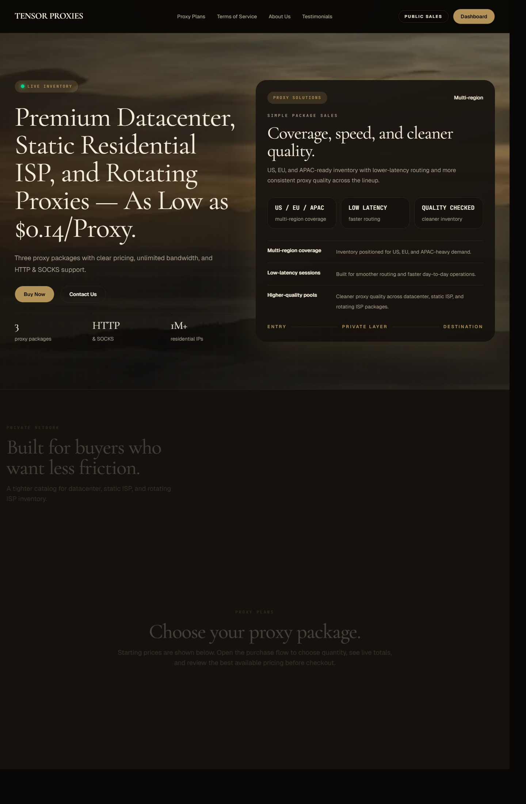
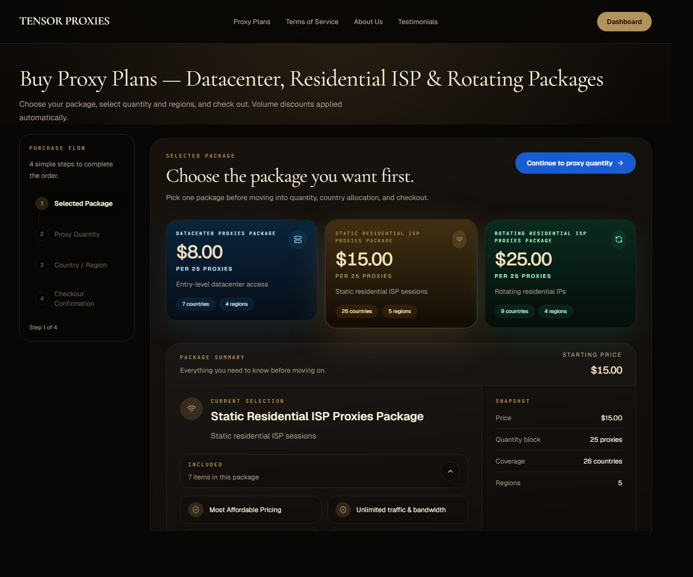
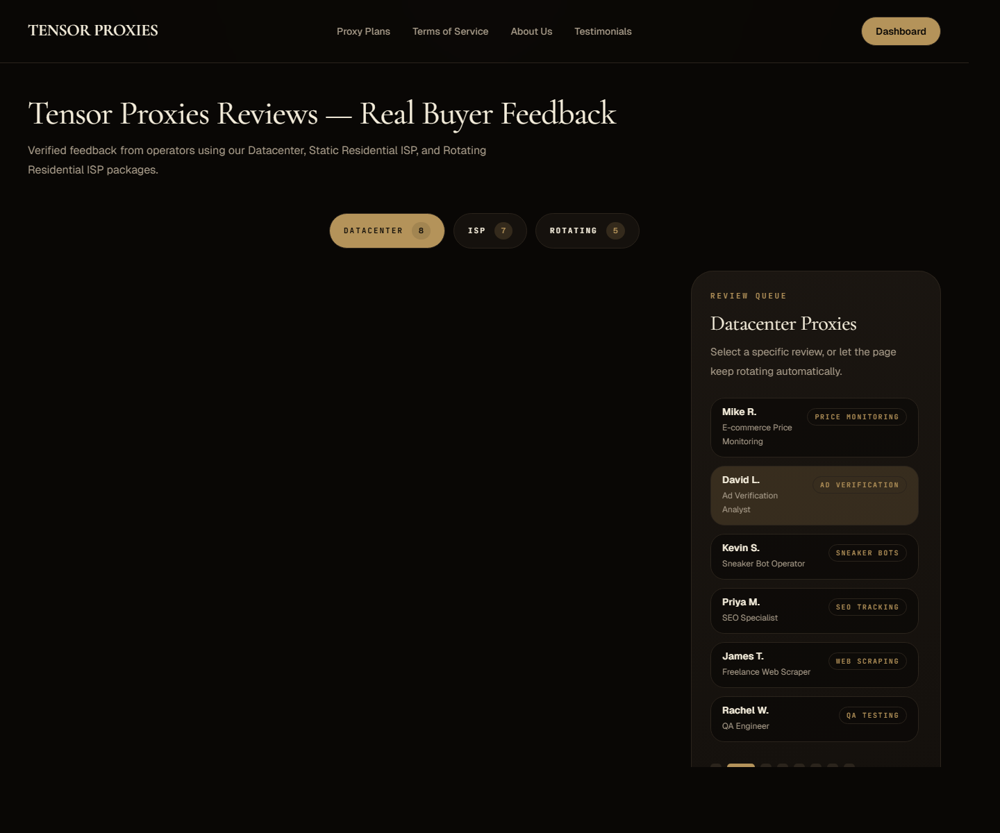

<h1 align="center">Tensor Proxies</h1>

  Premium datacenter, static residential ISP, and rotating residential proxy infrastructure.

  Built for teams that want clear pricing, fast fulfillment, and cleaner day-to-day operations.

  <a href="https://tensorproxies.com/">Website</a> |
  <a href="https://tensorproxies.com/proxy-plans">Proxy Plans</a> |
  <a href="https://tensorproxies.com/about">About</a> |
  <a href="https://tensorproxies.com/testimonials">Testimonials</a> |
  <a href="https://tensorproxies.com/contact-us">Contact</a>

  <strong>Live product</strong> |
  <strong>Codebase private</strong> |
  <strong>U.S.-based operations</strong>

## At a Glance

| Signal | Detail |
| --- | --- |
| Company | Tensor Proxies LLC |
| Started | Private sales since `January 2022` |
| Public launch | `March 2026` |
| Starting price | `From $8 / 25 proxies` |
| Products | Datacenter, Static Residential ISP, Rotating Residential ISP |
| Coverage | US, EU, APAC |
| Protocols | HTTP and SOCKS |
| Bandwidth | Unlimited |

## Product Snapshot

Tensor Proxies is a live proxy product focused on simplicity, speed, and operational reliability.
It is designed for buyers who want working proxies, predictable package pricing, and a direct purchase flow without unnecessary friction.

The service currently offers:

- Datacenter proxies
- Static residential ISP proxies
- Rotating residential ISP proxies
- HTTP and SOCKS support across the lineup
- Unlimited traffic and bandwidth
- Delivery in `IP:PORT:USERNAME:PASSWORD` format

## Live Preview

<table>
  <tr>
    <td width="33.33%" valign="top">
      
      
<strong>Homepage</strong> Landing page, plans, and product positioning.

    </td>
    <td width="33.33%" valign="top">
      
      
<strong>Plans</strong> Package selection flow with pricing and product breakdown.

    </td>
    <td width="33.33%" valign="top">
      
      
<strong>Testimonials</strong> Public customer feedback and package-specific proof points.

    </td>
  </tr>
</table>

## Built For

- Price monitoring and market intelligence
- Web scraping and structured data collection
- QA and geo testing
- Ad verification
- Account management workflows
- Supplier, portal, and regional access checks

## Product Lineup

| Product | Starting Price | Best For | Highlights |
| --- | --- | --- | --- |
| Datacenter Proxies | `$8 / 25 proxies` | Price monitoring, QA, geo checks, ad verification, general scraping | Low starting cost, unlimited bandwidth, HTTP and SOCKS support |
| Static Residential ISP Proxies | `$15 / 25 proxies` | Sticky sessions, account workflows, residential-looking traffic, stable identity | Static residential ISP sessions, unlimited bandwidth, 1M+ residential IPs |
| Rotating Residential ISP Proxies | `$25 / 25 proxies` | Larger-scale collection, rotating identity, multi-region traffic, dynamic workflows | Automatic rotation, unlimited bandwidth, large residential pool |

Pricing above reflects the public website as of April 5, 2026.

## Why Buyers Use Tensor Proxies

- Clear package-based pricing instead of metered bandwidth confusion
- Multi-region inventory for US, EU, and APAC-heavy demand
- Direct team access instead of anonymous ticket-queue support
- Private-sale operating history before public launch
- Cleaner product positioning than generic reseller panels

## What Stands Out

- Productized pricing instead of vague custom quotes
- A narrow, easy-to-understand lineup instead of dozens of confusing proxy SKUs
- Strong trust framing through public company details, operating history, and testimonials
- Live purchase flow, not just a brochure site

## Trust Signals

- Private sales began in `January 2022`
- Public sales opened in `March 2026`
- More than `4 years` of private-sale operating history before public launch
- Based in `Ashburn, Virginia`
- Public business address shown on the website
- Testimonials page with public customer feedback

These are all public claims or materials presented on the Tensor Proxies website.

## What This Repository Is

This repository is a public product overview for Tensor Proxies.

It exists to document the product, its positioning, and its public-facing materials without exposing internal infrastructure, fulfillment logic, or commercial implementation details.

## What This Repository Is Not

- It is not the production codebase
- It is not the proxy management backend
- It is not the internal operations toolchain
- It is not a public infrastructure repo

The live platform and supporting systems are private by design.

## Interested In The Product?

- Website: [tensorproxies.com](https://tensorproxies.com/)
- Plans: [tensorproxies.com/proxy-plans](https://tensorproxies.com/proxy-plans)
- Contact: [tensorproxies.com/contact-us](https://tensorproxies.com/contact-us)

## Links

- Main site: [tensorproxies.com](https://tensorproxies.com/)
- Proxy plans: [tensorproxies.com/proxy-plans](https://tensorproxies.com/proxy-plans)
- About: [tensorproxies.com/about](https://tensorproxies.com/about)
- Testimonials: [tensorproxies.com/testimonials](https://tensorproxies.com/testimonials)
- Privacy policy: [tensorproxies.com/privacy-policy](https://tensorproxies.com/privacy-policy)
- Contact: [tensorproxies.com/contact-us](https://tensorproxies.com/contact-us)
